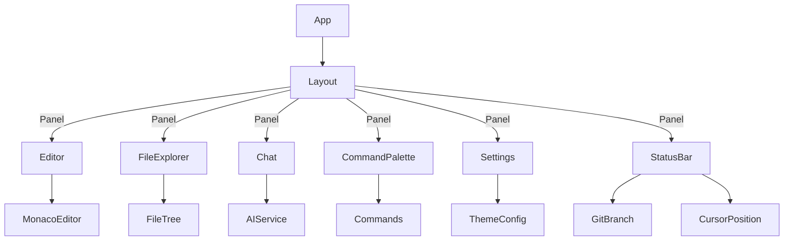

# Component Architecture Diagram

## Key Components
- **App**: Root entry, renders Layout.
- **Layout**: Manages all main panels and modals.
- **Editor**: Monaco Editor integration.
- **FileExplorer**: File tree and file operations.
- **Chat**: AI chat interface.
- **CommandPalette**: Quick command launcher.
- **Settings**: Theme and font configuration.
- **StatusBar**: Shows branch, language, cursor, etc.

_This diagram reflects the current/planned structure. Update as you add new features!_
